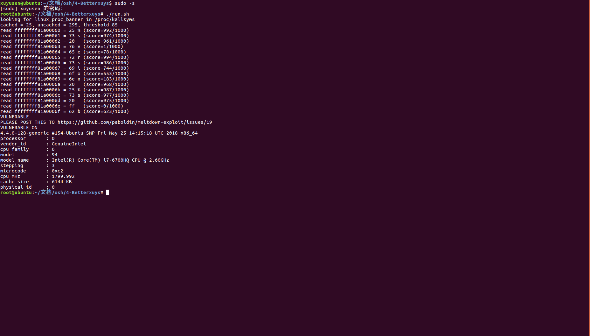

#lab4实验报告

代码引用自[paboldin/meltdown-exploit@github](https://github.com/paboldin/meltdown-exploit) 

可直接通过一下命令运行程序

	make
	./run.sh

##测试环境

ubuntu 16.04 LTS，内核版本4.4.0-128-generic
关闭meltdown补丁，具体方法见下文

##实验原理

由于乱序执行，CPU提前执行了后续的非法指令，在检测到应用程序访问了非法地址之前，来不及清除所有信息，利用这个窗口期可以建立侧信道攻击。
侧信道攻击是指不去攻击信道本身来获得信息，而是通过观信道双方通信时产生的其他影响，通过分析泄露的额外信息来建立映射，进而取得信息。
本实验利用指令流水中指令超前执行，在被超前执行的代码中故意去访问非授权地址a，a的内容被送入寄存器中参与临时运算，尝试以a的内容做地址去访问某块内存，导致该地址内容被cache；一个周期结束时，被检测出非法指令，所有数据被清除，但是cache中并未擦除；此时对整个内存进行扫描，测试访问速度，地址x访问时间极短说明该地址被cache，进而推断出a地址中的内容为x。
基于此方法，我们可以得到任意内存块中的内容，读取内核数据，其他程序，其他用户数据。

## 攻击步骤

###一. [首先关闭系统的meltdown补丁](https://community.spiceworks.com/topic/2108250-meltdown-patch-disable-fedora-27) 
打开/etc/default/grub在其中GRUB_CMDLINE_LINUX的值加上"nopti"

运行命令
		grub-mkconfig -o /boot/grub/grub.cfg
		reboot
重启后运行命令	
		grep . /sys/devices/system/cpu/vulnerabilities/*
输出应该是这样的
		/sys/devices/system/cpu/vulnerabilities/meltdown:Vulnerable

###二. 程序攻击流程

1. 运行./run.sh，首先在/proc/kallsyms中找到linux_proc_banner的地址，将linux_proc_banner的地址和希望读取的地址长度（十六进制）作为参数传给攻击程序meltdown

2. set_cache_hit_threshold()函数测试出访问已被cache内容和未被cache内容的访问平均时间，算出它们的几何平均数作为阈值，之后程序中会用阈值来判断读取的内容是否在cache中命中

3. 对每个指定地址进行1000次访问，每次会返回一个猜测的值，比较猜测值与我们的期望值是否相同
期望值为

		static char expected[] = "%s version %s";

4. 全局数组target_array[256*4096]，用于观察哪个地址读取时间，根据较快的读取时间确认攻击地址的值

**为什么是4096？**
intel官方手册中提到，cpu一次只会缓存一页内容，一页大小为4096

5. 核心攻击部分为readbyte(int fd, unsigned long addr)，该函数会返回一个字节的猜测值
首先memset hist，防止该数组有一些值存留在cache中
pread读取一个文件，继续清空cache
clflush_target()函数将数组target_array从cache中清空
_mm_mfence()函数可提高成功率：它充当完整的内存屏障，确保在任何后续加载或存储开始执行之前，所有先前的加载和存储都已完成
speculate(addr)函数尝试攻击指定地址的内容，即用该地址的内容作为下标读取内容，但由于权限原因不会实际读出，然而由于指令预执行会使cache会出现变化
check()函数检查target_array数组里每个值的提取时间，如果时间小于阈值，则认为在cache中命中，命中最多那个即猜测结果。
将上述重复1000次即得到了一个字节的猜测结果
本次试验读取了16个地址的内容

##其余部分代码解读

1. 头文件rdtscp.h中包含一个计算访问时间的函数

   ```c
   static inline int
   get_access_time(volatile char *addr){
   	unsigned long long time1, time2;
   	unsigned junk;
   	time1 = __rdtscp(&junk);
   	(void)*addr;
   	time2 = __rdtscp(&junk);
   	return time2 - time1;
   }
   ```

   记录访问前和访问后的时间，二者相减即为访问时间

2. volatile会让编译器不优化代码


##预期结果

如图所示


##特别感谢

特别感谢李子天助教解决Linux和NVIDIA之间的爱恨情仇
